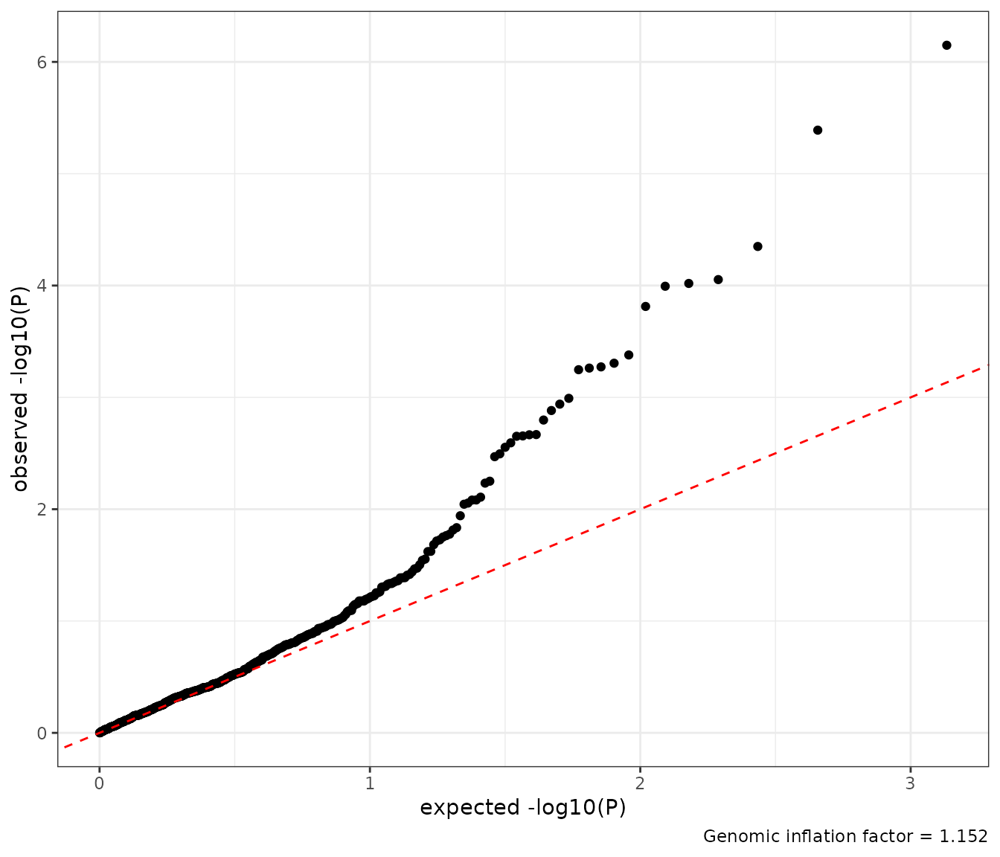
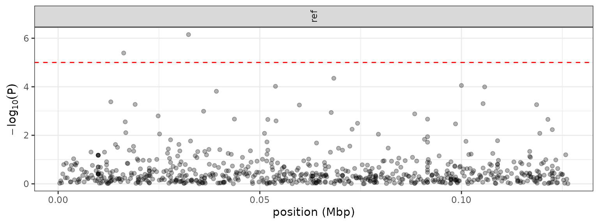
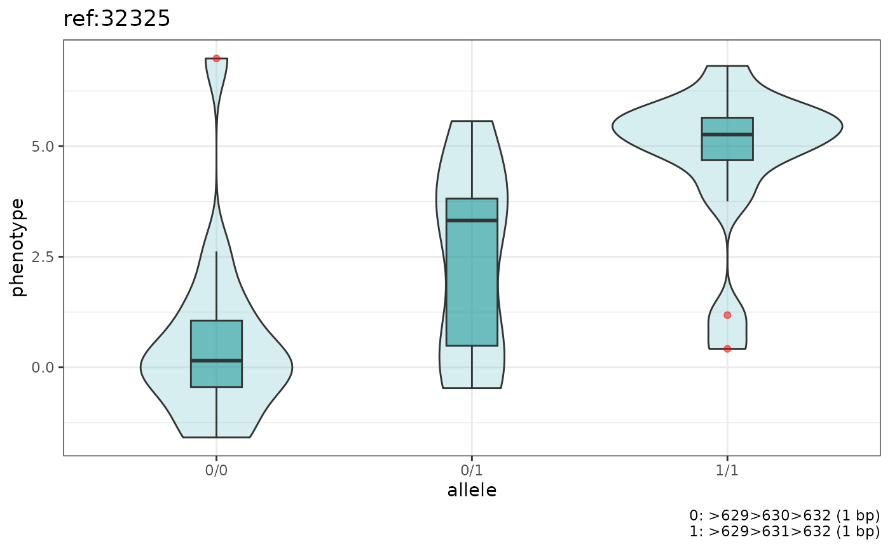
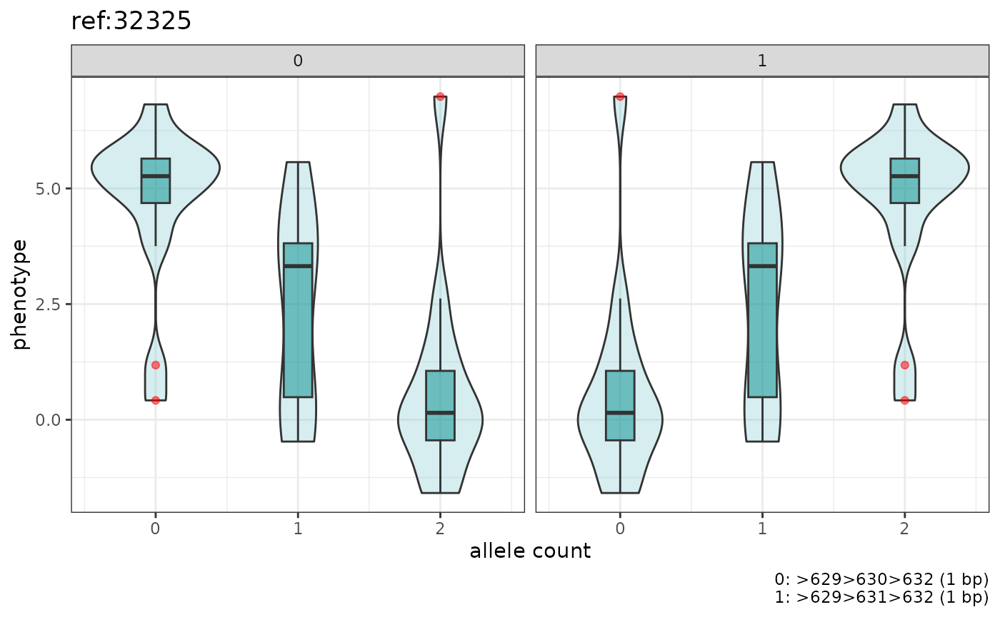
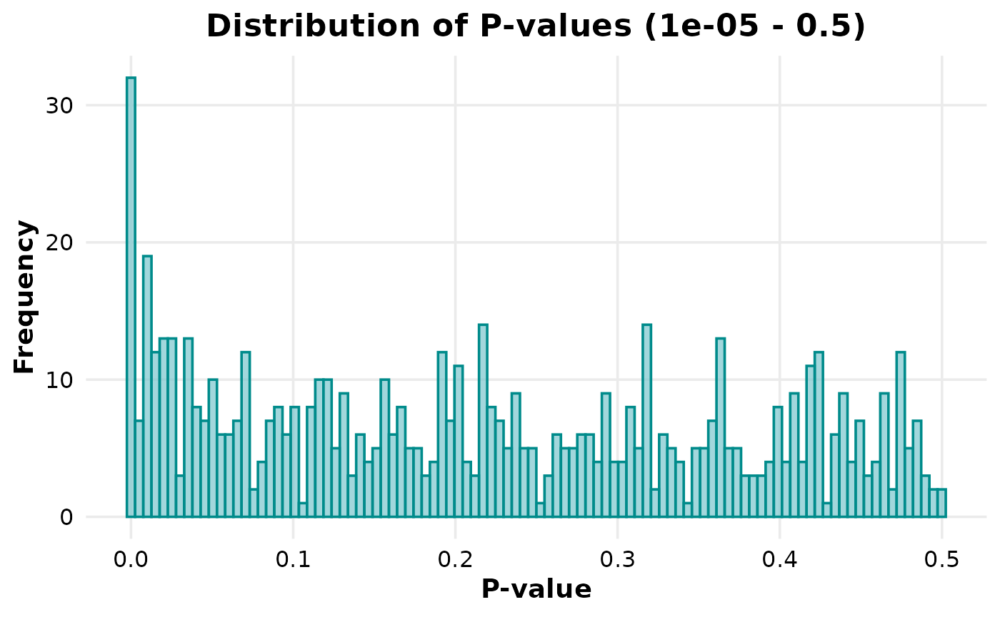
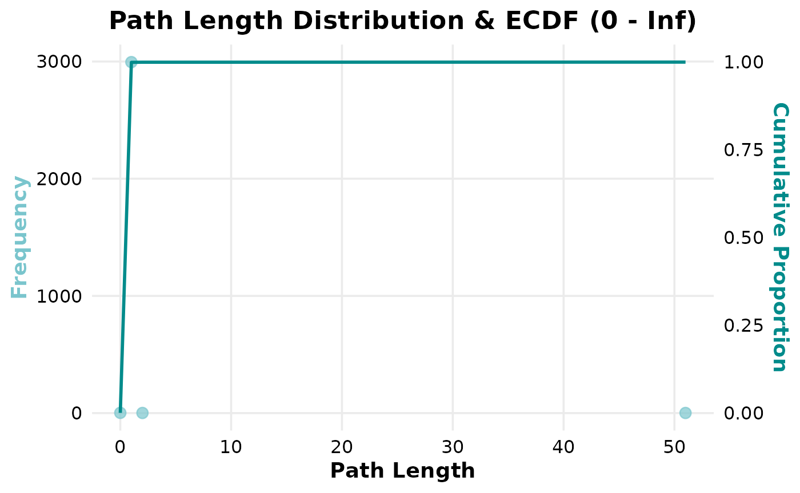
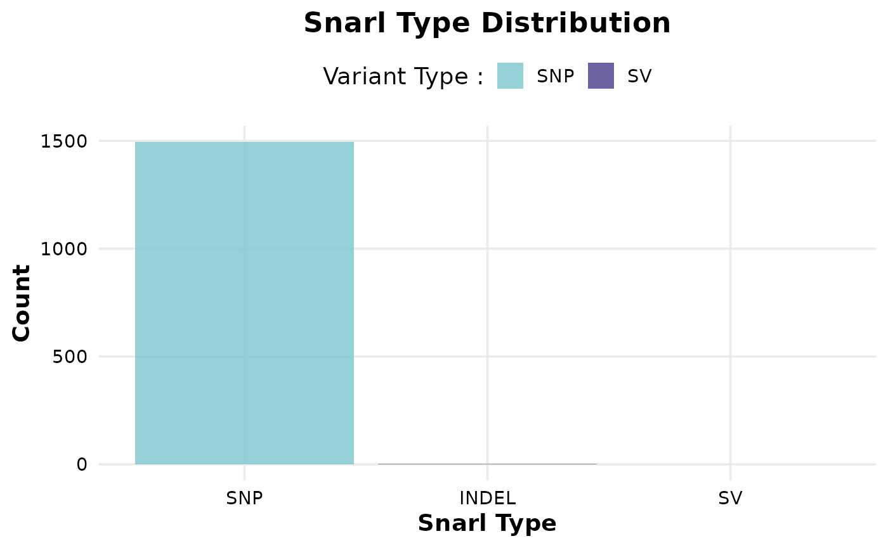

# STOAT Plot overview

``` r

library(StoatPlot)
library(ggplot2)
library(dplyr)
#> 
#> Attaching package: 'dplyr'
#> The following objects are masked from 'package:stats':
#> 
#>     filter, lag
#> The following objects are masked from 'package:base':
#> 
#>     intersect, setdiff, setequal, union
library(knitr)
```

## Import association results

``` r

## path to association file (~stoat.assoc.pvalues.tsv.gz)
test_data_dir <- system.file('extdata', package='StoatPlot')
assoc_file = file.path(test_data_dir, 'stoat.quantitative.assoc.pvalues.tsv.gz')

## import association results
assoc = import_assoc(assoc_file)
```

## Summary

``` r

sum.l = summary_stoat(assoc)
```

| Metric                    | Value |
|:--------------------------|------:|
| Total variants            |   680 |
| Variant PV\<0.01          |    31 |
| Variant adjusted PV\<0.01 |     2 |
| Genomic inflation factor  |  1.15 |

| Type | Total | Pv_BH_below_0.01 |
|:-----|------:|-----------------:|
| SNP  |   519 |                2 |
| SV   |   161 |                0 |

## QQ-plot

``` r

qq_plot(assoc)
```



## Manhattan plot

``` r

manhattan_plot(assoc, show_top_points=1000)
```



## Top-associated variants

``` r

assoc |> arrange(P) |> head(10) |> kable()
```

| CHR | START_OFFSET | START_NODE | END_NODE | ALLELE_LENGTHS |         P |
|:----|-------------:|:-----------|:---------|:---------------|----------:|
| ref |        32325 | \>629      | \<632    | 1,1            | 0.0000007 |
| ref |        16257 | \>310      | \<313    | 1,1            | 0.0000041 |
| ref |        68351 | \>1271     | \<1274   | 1,1            | 0.0000447 |
| ref |        99994 | \>1815     | \<1818   | 1,1            | 0.0000884 |
| ref |        53887 | \>1010     | \<1012   | 0,248          | 0.0000957 |
| ref |       105752 | \>1896     | \<1899   | 1,1            | 0.0001014 |
| ref |        39235 | \>765      | \<768    | 1,1            | 0.0001537 |
| ref |        13062 | \>255      | \<266    | 0,602          | 0.0004176 |
| ref |       105360 | \>1888     | \<1893   | 0,571          | 0.0004948 |
| ref |        19088 | \>356      | \<359    | 1,1            | 0.0005337 |

## Make a plot for the top association

``` r

## prepare file names for the genotypes and phenotype
gt_fn = file.path(test_data_dir, 'snarl_genotypes.sorted.tsv.gz')
pheno_fn = file.path(test_data_dir, 'phenotype.quantitative.tsv')

## get the most associated variant
top.assoc = assoc |> arrange(P) |> head(1)

## boxplot with samples grouped by genotype
genotype_boxplots(gt_fn, pheno_fn, top.assoc)
```



``` r


## boxplot with samples grouped by allele
genotype_boxplots(gt_fn, pheno_fn, top.assoc, by_allele=TRUE)
```



## Other graphs

``` r

# Histogram of p-values
plot_pvalue_hist(
  file.path(test_data_dir, "gwas", "binary.assoc.chi2.tsv"),
  p_column="P_CHI2",
  min = 0.00001,
  max = 0.5
)
```



``` r


# Dot plot of Path Length Frequencies
path_length_distribution(file.path(test_data_dir, "snarl_paths", "binary.snarl.tsv"))
#> Warning: Use of `freq_df$Path_Length` is discouraged.
#> ℹ Use `Path_Length` instead.
#> Warning: Use of `freq_df$Frequency` is discouraged.
#> ℹ Use `Frequency` instead.
#> Warning: Use of `ecdf_df$Cumulative_scaled` is discouraged.
#> ℹ Use `Cumulative_scaled` instead.
```



``` r


# Snarl type histogram
snarl_type_histogram(file.path(test_data_dir, "snarl_paths", "binary.snarl.tsv"))
#>   Variant_Type Count
#> 1        INDEL     3
#> 2          SNP  1495
#> 3           SV     1
```


